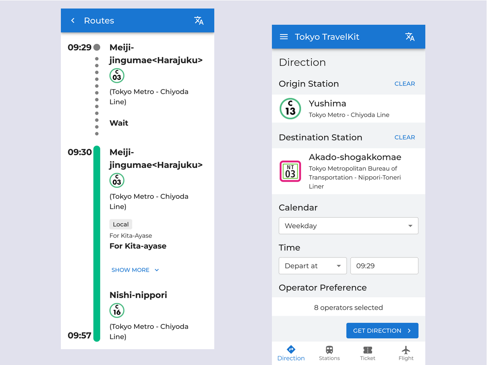

# Tokyo TravelKit

> A full-stack multi-language web-based trip planner which provides transfer directions for train trips in Tokyo, Japan.

## Code Base

### Front End

React.js, Redux, MUI, TypeScript

<https://github.com/wtongze/tokyo-travelkit-frontend>

### Back End

SQLite, Express.js, TypeScript, C++

<https://github.com/wtongze/tokyo-travelkit-backend>
